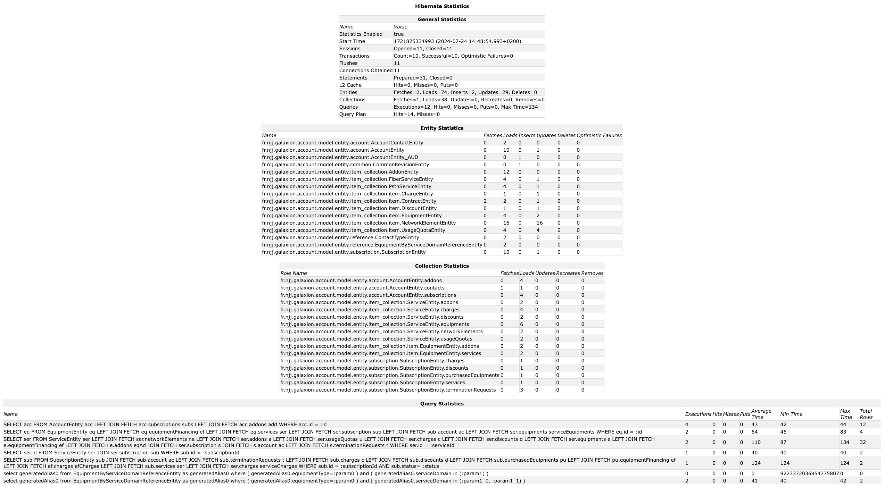

### Spring Boot DataSource Decorator

[](https://github.com/gavlyukovskiy/spring-boot-data-source-decorator/actions/workflows/on-master.yml?query=branch%3Amaster)
[](https://mvnrepository.com/artifact/com.github.gavlyukovskiy/datasource-decorator-spring-boot-autoconfigure/)

[Spring Boot](https://github.com/spring-projects/spring-boot) auto-configuration for integration with
* [P6Spy](https://github.com/p6spy/p6spy) - adds ability to intercept and log sql queries, including interception of a most `Connection`, `Statement` and `ResultSet` methods invocations
* [Datasource Proxy](https://github.com/ttddyy/datasource-proxy) - adds ability to intercept all queries and `Connection`, `Statement` and `ResultSet` method calls
* [FlexyPool](https://github.com/vladmihalcea/flexy-pool) - adds connection pool metrics (jmx, codahale, dropwizard) and flexible strategies for adjusting pool size on demand

#### Why not wrap DataSource in a configuration?

Instead of using the library you can manually wrap your `DataSource`, but this library also provides
* ability to use `@ConfigurationProperties` provided by Spring Boot (`spring.datasource.hikari.*`, `spring.datasource.dbcp2.*`)
* disabling decorating by deployment property `decorator.datasource.enabled=true/false`
* configure proxies through spring properties `application.properties/yml` and customize proxies by defining beans in the spring context

#### Quick Start

Add one of the starters to the classpath of a Spring Boot 3 application and your datasources (auto-configured or custom) will be wrapped into one of a datasource proxy providers below.

The latest release version is [](https://mvnrepository.com/artifact/com.github.gavlyukovskiy/datasource-decorator-spring-boot-autoconfigure/)

> [!NOTE]  
> For Spring Boot 2 applications, the latest compatible version is 1.8.1.

If you want to use [P6Spy](https://github.com/p6spy/p6spy)
```groovy
implementation("com.github.gavlyukovskiy:p6spy-spring-boot-starter:${version}")
```
```xml
<dependency>
    <groupId>com.github.gavlyukovskiy</groupId>
    <artifactId>p6spy-spring-boot-starter</artifactId>
    <version>${version}</version>
</dependency>
```

or [Datasource Proxy](https://github.com/ttddyy/datasource-proxy):
```groovy
implementation("com.github.gavlyukovskiy:datasource-proxy-spring-boot-starter:${version}")
```
```xml
<dependency>
    <groupId>com.github.gavlyukovskiy</groupId>
    <artifactId>datasource-proxy-spring-boot-starter</artifactId>
    <version>${version}</version>
</dependency>
```

or [FlexyPool](https://github.com/vladmihalcea/flexy-pool)
> To use FlexyPool with connection pool other than HikariCP you must add `PoolAdapter` for your [particular connection pool](https://github.com/vladmihalcea/flexy-pool/wiki/Installation-Guide#connection-pool-settings).
```groovy
implementation("com.github.gavlyukovskiy:flexy-pool-spring-boot-starter:${version}")
```
```xml
<dependency>
    <groupId>com.github.gavlyukovskiy</groupId>
    <artifactId>flexy-pool-spring-boot-starter</artifactId>
    <version>${version}</version>
</dependency>
```

##### What if I add multiple decorators?

You can use all decorators at the same time if you need, if so decorating order will be:

```P6DataSource -> ProxyDataSource -> FlexyPoolDataSource -> DataSource```

#### P6Spy

After adding p6spy starter you'll start getting all sql queries in the logs:
```text
2017-06-07 21:42:08.120  INFO 5456 --- [ool-1-worker-57] p6spy                                    : #1496860928120 | took 0ms | statement | connection 0|SELECT NOW()
;
2017-06-07 21:51:07.802  INFO 5456 --- [ool-1-worker-50] p6spy                                    : #1496861467802 | took 0ms | statement | connection 1|SELECT NOW()
;
2017-06-07 21:51:07.803  INFO 5456 --- [ool-1-worker-43] p6spy                                    : #1496861467803 | took 0ms | statement | connection 2|SELECT NOW()
;
2017-06-07 21:51:08.806  INFO 5456 --- [ool-1-worker-36] p6spy                                    : #1496861468806 | took 0ms | statement | connection 3|SELECT NOW()
;
```

All beans of type `JdbcEventListener` are registered in P6Spy:
```java
@Bean
public JdbcEventListener myListener() {
    return new JdbcEventListener() {
        @Override
        public void onAfterGetConnection(ConnectionInformation connectionInformation, SQLException e) {
            System.out.println("got connection");
        }

        @Override
        public void onAfterConnectionClose(ConnectionInformation connectionInformation, SQLException e) {
            System.out.println("connection closed");
        }
    };
}
```

This done by adding `RuntimeListenerSupportFactory` into P6Spy `modulelist`, overriding this property will cause to not registering factory thus listeners will not be applied

You can configure small set of parameters in your `application.properties`:
> [!NOTE]
> Configuration below indicates al possible parameters together with their default values and **does not** need to be set explicitly
```properties
# Register P6LogFactory to log JDBC events
decorator.datasource.p6spy.enable-logging=true
# Use com.p6spy.engine.spy.appender.MultiLineFormat instead of com.p6spy.engine.spy.appender.SingleLineFormat
decorator.datasource.p6spy.multiline=true
# Use logging for default listeners [slf4j, sysout, file, custom]
decorator.datasource.p6spy.logging=slf4j
# Log file to use (only with logging=file)
decorator.datasource.p6spy.log-file=spy.log
# Class file to use (only with logging=custom). The class must implement com.p6spy.engine.spy.appender.FormattedLogger
decorator.datasource.p6spy.custom-appender-class=my.custom.LoggerClass
# Custom log format, if specified com.p6spy.engine.spy.appender.CustomLineFormat will be used with this log format
decorator.datasource.p6spy.log-format=
# Use regex pattern to filter log messages. If specified only matched messages will be logged.
decorator.datasource.p6spy.log-filter.pattern=
```

Also you can configure P6Spy manually using one of available configuration methods. For more information please refer to the [P6Spy Configuration Guide](http://p6spy.readthedocs.io/en/latest/configandusage.html)

#### Datasource Proxy

After adding datasource-proxy starter you'll start getting all sql queries in the logs with level `DEBUG` and slow sql queries with level `WARN`:
```text
2017-06-07 21:58:06.630  DEBUG 8492 --- [ool-1-worker-57] n.t.d.l.l.SLF4JQueryLoggingListener      :
Name:, Time:0, Success:True
Type:Statement, Batch:False, QuerySize:1, BatchSize:0
Query:["SELECT NOW()"]
Params:[]
2017-06-07 21:58:06.630  DEBUG 8492 --- [ool-1-worker-43] n.t.d.l.l.SLF4JQueryLoggingListener      :
Name:, Time:0, Success:True
Type:Statement, Batch:False, QuerySize:1, BatchSize:0
Query:["SELECT NOW()"]
Params:[]
2017-06-07 21:58:06.630  DEBUG 8492 --- [ool-1-worker-50] n.t.d.l.l.SLF4JQueryLoggingListener      :
Name:, Time:0, Success:True
Type:Statement, Batch:False, QuerySize:1, BatchSize:0
Query:["SELECT NOW()"]
Params:[]
2017-06-07 22:10:50.478  WARN 8492 --- [pool-1-thread-1] n.t.d.l.logging.SLF4JSlowQueryListener   :
Name:, Time:0, Success:False
Type:Statement, Batch:False, QuerySize:1, BatchSize:0
Query:["SELECT SLEEP(301000)"]
Params:[]
```

You can add custom `QueryExecutionListener` by registering them in the context, as well you can override `ParameterTransformer`, `QueryTransformer` and `ConnectionIdManager`:
```java
@Bean
public QueryExecutionListener queryExecutionListener() {
    return new QueryExecutionListener() {
        @Override
        public void beforeQuery(ExecutionInfo execInfo, List<QueryInfo> queryInfoList) {
            System.out.println("beforeQuery");
        }

        @Override
        public void afterQuery(ExecutionInfo execInfo, List<QueryInfo> queryInfoList) {
            System.out.println("afterQuery");
        }
    };
}

@Bean
public ParameterTransformer parameterTransformer() {
    return new MyParameterTransformer();
}

@Bean
public QueryTransformer queryTransformer() {
    return new MyQueryTransformer();
}

@Bean
public ConnectionIdManagerProvider connectionIdManagerProvider() {
    return MyConnectionIdManager::new;
}
```
You can configure logging, query/slow query listeners and more using your `application.properties`:
> [!NOTE]
> Configuration below indicates al possible parameters together with their default values and **does not** need to be set explicitly
```properties
# One of logging libraries (slf4j, jul, common, sysout)
decorator.datasource.datasource-proxy.logging=slf4j

decorator.datasource.datasource-proxy.query.enable-logging=true
decorator.datasource.datasource-proxy.query.log-level=debug
# Logger name to log all queries, default depends on chosen logging, e.g. net.ttddyy.dsproxy.listener.logging.SLF4JQueryLoggingListener
decorator.datasource.datasource-proxy.query.logger-name=

decorator.datasource.datasource-proxy.slow-query.enable-logging=true
decorator.datasource.datasource-proxy.slow-query.log-level=warn
decorator.datasource.datasource-proxy.slow-query.logger-name=
# Number of seconds to consider query as slow and log it
decorator.datasource.datasource-proxy.slow-query.threshold=300

decorator.datasource.datasource-proxy.multiline=true

# Formats the SQL for better readability. Uses Hibernate's formatter if present on the class path. If you opted in for a different JPA provider you need to add https://github.com/vertical-blank/sql-formatter as a runtime dependency to your app  to enable this. 
# Mutually exclusive with json-format=true
decorator.datasource.datasource-proxy.format-sql=false
decorator.datasource.datasource-proxy.json-format=false

# Enable Query Metrics
decorator.datasource.datasource-proxy.count-query=false
```

#### Flexy Pool

If the `flexy-pool-spring-boot-starter` is added to the classpath your datasource will be wrapped to the `FlexyPoolDataSource`.
With default setting you will start getting messages about acquiring and leasing connections:
```text
2017-07-13 01:31:02.575  INFO 5432 --- [ool-1-worker-50] c.v.flexypool.FlexyPoolDataSource        : Connection leased for 1500 millis, while threshold is set to 1000 in dataSource FlexyPoolDataSource
2017-07-13 01:31:03.143  WARN 5432 --- [ool-1-worker-51] PoolOnTimeoutConnectionAcquiringStrategy : Connection was acquired in 1502 millis, timeoutMillis is set to 500
2017-07-13 01:31:03.143  INFO 5432 --- [ool-1-worker-51] PoolOnTimeoutConnectionAcquiringStrategy : Pool size changed from previous value 10 to 11
```
You can declare bean `MetricsFactory` and besides of JMX metrics will be exported to the metrics provider and to the logs:
```text
2017-07-13 02:07:04.265  INFO 5432 --- [rter-1-thread-1] c.v.f.metric.codahale.CodahaleMetrics    : type=HISTOGRAM, name=concurrentConnectionRequestsHistogram, count=4, min=0, max=1, mean=0.5, stddev=0.5, median=1.0, p75=1.0, p95=1.0, p98=1.0, p99=1.0, p999=1.0
2017-07-13 02:07:04.265  INFO 5432 --- [rter-1-thread-1] c.v.f.metric.codahale.CodahaleMetrics    : type=HISTOGRAM, name=concurrentConnectionsHistogram, count=4, min=0, max=1, mean=0.5, stddev=0.5, median=1.0, p75=1.0, p95=1.0, p98=1.0, p99=1.0, p999=1.0
2017-07-13 02:07:04.265  INFO 5432 --- [rter-1-thread-1] c.v.f.metric.codahale.CodahaleMetrics    : type=HISTOGRAM, name=maxPoolSizeHistogram, count=1, min=10, max=10, mean=10.0, stddev=0.0, median=10.0, p75=10.0, p95=10.0, p98=10.0, p99=10.0, p999=10.0
2017-07-13 02:07:04.265  INFO 5432 --- [rter-1-thread-1] c.v.f.metric.codahale.CodahaleMetrics    : type=HISTOGRAM, name=overflowPoolSizeHistogram, count=0, min=0, max=0, mean=0.0, stddev=0.0, median=0.0, p75=0.0, p95=0.0, p98=0.0, p99=0.0, p999=0.0
2017-07-13 02:07:04.265  INFO 5432 --- [rter-1-thread-1] c.v.f.metric.codahale.CodahaleMetrics    : type=HISTOGRAM, name=retryAttemptsHistogram, count=0, min=0, max=0, mean=0.0, stddev=0.0, median=0.0, p75=0.0, p95=0.0, p98=0.0, p99=0.0, p999=0.0
2017-07-13 02:07:04.265  INFO 5432 --- [rter-1-thread-1] c.v.f.metric.codahale.CodahaleMetrics    : type=TIMER, name=connectionAcquireMillis, count=2, min=0.0, max=39.0, mean=19.5, stddev=19.5, median=39.0, p75=39.0, p95=39.0, p98=39.0, p99=39.0, p999=39.0, mean_rate=0.07135042014375073, m1=0.02490778899904623, m5=0.006288975787638508, m15=0.002179432534806779, rate_unit=events/second, duration_unit=milliseconds
2017-07-13 02:07:04.265  INFO 5432 --- [rter-1-thread-1] c.v.f.metric.codahale.CodahaleMetrics    : type=TIMER, name=connectionLeaseMillis, count=2, min=3.0, max=7.0, mean=5.0, stddev=2.0, median=7.0, p75=7.0, p95=7.0, p98=7.0, p99=7.0, p999=7.0, mean_rate=0.07135743555785098, m1=0.02490778899904623, m5=0.006288975787638508, m15=0.002179432534806779, rate_unit=events/second, duration_unit=milliseconds
2017-07-13 02:07:04.265  INFO 5432 --- [rter-1-thread-1] c.v.f.metric.codahale.CodahaleMetrics    : type=TIMER, name=overallConnectionAcquireMillis, count=2, min=0.0, max=39.0, mean=19.5, stddev=19.5, median=39.0, p75=39.0, p95=39.0, p98=39.0, p99=39.0, p999=39.0, mean_rate=0.07135462550886962, m1=0.02490778899904623, m5=0.006288975787638508, m15=0.002179432534806779, rate_unit=events/second, duration_unit=milliseconds
```

All beans of type `ConnectionAcquiringStrategyFactory` are used to provide `ConnectionAcquiringStrategy` for the pool.

`MetricsFactory` and `ConnectionProxyFactory` beans can be used to customize metrics and connection decorators.

`EventListener<? extends Event>` beans can be registered to subscribe on events of flexy-pool (e.g. `ConnectionAcquireTimeThresholdExceededEvent`, `ConnectionLeaseTimeThresholdExceededEvent`).

You can configure your `FlexyPoolDataSource` by using bean `FlexyPoolConfigurationBuilderCustomizer` or properties:
> [!NOTE]
> Configuration below indicates al possible parameters together with their default values and **does not** need to be set explicitly
```properties
# Increments pool size if connection acquire request has timed out
decorator.datasource.flexy-pool.acquiring-strategy.increment-pool.max-overflow-pool-size=15
decorator.datasource.flexy-pool.acquiring-strategy.increment-pool.timeout-millis=500

# Retries on getting connection
decorator.datasource.flexy-pool.acquiring-strategy.retry.attempts=2

# Enable metrics exporting to the JMX
decorator.datasource.flexy-pool.metrics.reporter.jmx.enabled=true
decorator.datasource.flexy-pool.metrics.reporter.jmx.auto-start=false

# Millis between two consecutive log reports
decorator.datasource.flexy-pool.metrics.reporter.log.millis=300000

# Enable logging and publishing ConnectionAcquireTimeThresholdExceededEvent when a connection acquire request has timed out
decorator.datasource.flexy-pool.threshold.connection.acquire=50
# Enable logging and publishing ConnectionLeaseTimeThresholdExceededEvent when a connection lease has exceeded the given time threshold
decorator.datasource.flexy-pool.threshold.connection.lease=1000
```

#### Spring Cloud Sleuth (deprecated)

##### For Spring Boot users, that DO NOT use Spring Cloud Sleuth
Nothing has changed, this project is continued to be supported and maintained, and can be used to enable JDBC logging
and provide auto-configuration of P6Spy, Datasource-Proxy and FlexyPool.


##### For Spring Cloud Sleuth users
As of release 1.8.0 Spring Cloud Sleuth integration was deprecated in favor of [Spring Cloud Sleuth: Spring JDBC](https://docs.spring.io/spring-cloud-sleuth/docs/3.1.0/reference/html/integrations.html#sleuth-jdbc-integration)
which provides JDBC instrumentation out of the box.

As of release 1.9.0 Spring Cloud Sleuth integration was removed.

Spring Cloud Sleuth JDBC was based on this project and keeps all functionality including logging, tracing, configuration and customizations.

##### Migration process:
1. If you are using Spring Cloud Sleuth you can migrate all properties from `decorator.datasource.*` to `spring.sleuth.jdbc.*` with minimal changes.
2. If you have query logging enabled (default state) then you need to explicitly enable logging using:
   - P6Spy: `spring.sleuth.jdbc.p6spy.enable-logging=true`
   - Datasource-Proxy: `spring.sleuth.jdbc.datasource-proxy.query.enable-logging=true`
3. If you were using decoration customizers please consult with Spring Cloud Sleuth documentation and migrate usage of those to appropriate alternatives in Spring Cloud Sleuth
4. _(Optional)_ Replace dependency on this starter with the particular library
   - P6Spy: replace `com.github.gavlyukovskiy:p6spy-spring-boot-starter` with `p6spy:p6spy`
   - Datasource-Proxy: replace `com.github.gavlyukovskiy:datasource-proxy-spring-boot-starter` with `net.ttddyy:datasource-proxy`
5. Any issues can be raised in Spring Cloud Sleuth  project on GitHub, you may tag me (@gavlyukovskiy) and I'll try to help.
6. Enjoy using JDBC instrumentation, and thank you for using this library :)
 
Due to similarities in implementation, using starters from this library together with Spring Cloud Sleuth 3.1.0 is possible, although decoration will be automatically disabled in favor of Spring Cloud Sleuth to avoid duplicated logging, tracing or any other potential issues.

#### Custom Decorators

Custom data source decorators are supported through declaring beans of type `DataSourceDecorator`
```java
@Bean
public DataSourceDecorator customDecorator() {
  return (beanName, dataSource) -> new DataSourceWrapper(dataSource);
}
```

#### Disable Decorating

If you want to disable decorating set `decorator.datasource.exclude-beans` with bean names you want to exclude.
Also, you can disable decorating for `AbstractRoutingDataSource` setting property `decorator.datasource.ignore-routing-data-sources` to `true`
Set `decorator.datasource.enabled` to `false` if you want to disable all decorators for all datasources. 


Hibernate statiscis 

```java
package fr.njj.galaxion.account.config;

import org.hibernate.SessionFactory;
import org.hibernate.stat.CollectionStatistics;
import org.hibernate.stat.EntityStatistics;
import org.hibernate.stat.QueryStatistics;
import org.hibernate.stat.Statistics;

import javax.persistence.EntityManagerFactory;
import java.text.SimpleDateFormat;
import java.util.Arrays;
import java.util.Date;

public class HibernateStatisticsUtil {

    /**
     * Generate a custom HTML stats report for the Hibernate session factory from a given entity manager factory.
     */
    public static String generateStatsReport(EntityManagerFactory entityManagerFactory, boolean clear) {
        SessionFactory sessionFactory = entityManagerFactory.unwrap(SessionFactory.class);
        Statistics stats = sessionFactory.getStatistics();

        StringBuilder buffer = new StringBuilder(32768);

        // Add the various parts of the stats file
        writeHeader(buffer);
        writeGeneralStats(stats, buffer);
        writeEntityStats(stats, buffer);
        writeCollectionStats(stats, buffer);
        writeQueryStats(stats, buffer);

        if (clear) {
            stats.clear();
        }

        return buffer.toString();
    }

    private static void writeHeader(StringBuilder buffer) {
        buffer.append("<html><head>\n");
        buffer.append("<meta charset=\"UTF-8\">\n");
        buffer.append("<style type=\"text/css\">\n");
        buffer.append("body, table { font: normal 14px Verdana, Arial, sans-serif; }\n");
        buffer.append("table { border-collapse: collapse; }\n");
        buffer.append("tr:nth-of-type(odd) { background-color:#EEEEEE; }\n");
        buffer.append("td, th { border: 1px solid lightgrey; }\n");
        buffer.append("</style>\n");
        buffer.append("<title>Hibernate Statistics</title></head><body><center><b>Hibernate Statistics</b><br>\n");
    }

    private static void writeGeneralStats(Statistics stats, StringBuilder buffer) {
        buffer.append("<br>\n");
        buffer.append("<table>\n");
        buffer.append("<tr><th colspan=2>General Statistics</th></tr>");
        buffer.append("<tr><td><i>Name</i></td><td><i>Value</i></td></tr>\n");
        writeObjectStat("Statistics Enabled", stats.isStatisticsEnabled(), buffer);
        writeObjectStat("Start Time", stats.getStartTime() + " (" + getFormattedTimestamp(stats.getStartTime()) + ")", buffer);
        writeObjectStat("Sessions",
                        "Opened=" + stats.getSessionOpenCount() +
                        ", Closed=" + stats.getSessionCloseCount(), buffer);
        writeObjectStat("Transactions",
                        "Count=" + stats.getTransactionCount() +
                        ", Successful=" + stats.getSuccessfulTransactionCount() +
                        ", Optimistic Failures=" + stats.getOptimisticFailureCount(), buffer);
        writeObjectStat("Flushes", stats.getFlushCount(), buffer);
        writeObjectStat("Connections Obtained", stats.getConnectCount(), buffer);
        writeObjectStat("Statements",
                        "Prepared=" + stats.getPrepareStatementCount() +
                        ", Closed=" + stats.getCloseStatementCount(), buffer);
        writeObjectStat("L2 Cache",
                        "Hits=" + stats.getSecondLevelCacheHitCount() +
                        ", Misses=" + stats.getSecondLevelCacheMissCount() +
                        ", Puts=" + stats.getSecondLevelCachePutCount(), buffer);
        writeObjectStat("Entities",
                        "Fetches=" + stats.getEntityFetchCount() +
                        ", Loads=" + stats.getEntityLoadCount() +
                        ", Inserts=" + stats.getEntityInsertCount() +
                        ", Updates=" + stats.getEntityUpdateCount() +
                        ", Deletes=" + stats.getEntityDeleteCount(), buffer);
        writeObjectStat("Collections",
                        "Fetches=" + stats.getCollectionFetchCount() +
                        ", Loads=" + stats.getCollectionLoadCount() +
                        ", Updates=" + stats.getCollectionUpdateCount() +
                        ", Recreates=" + stats.getCollectionRecreateCount() +
                        ", Removes=" + stats.getCollectionRemoveCount(), buffer);
        writeObjectStat("Queries",
                        "Executions=" + stats.getQueryExecutionCount() +
                        ", Hits=" + stats.getQueryCacheHitCount() +
                        ", Misses=" + stats.getQueryCacheMissCount() +
                        ", Puts=" + stats.getQueryCachePutCount() +
                        ", Max Time=" + stats.getQueryExecutionMaxTime(), buffer);
        writeObjectStat("Query Plan",
                        "Hits=" + stats.getQueryPlanCacheHitCount() +
                        ", Misses=" + stats.getQueryPlanCacheMissCount(), buffer);
        buffer.append("</table>\n");
    }

    private static void writeObjectStat(String name, Object value, StringBuilder buffer) {
        buffer.append("<tr><td>");
        buffer.append(name);
        buffer.append("</td><td>");
        buffer.append(value);
        buffer.append("</td></tr>\n");
    }

    private static void writeEntityStats(Statistics stats, StringBuilder buffer) {
        buffer.append("<br>\n");
        buffer.append("<table>\n");
        buffer.append("<tr><th colspan=7>Entity Statistics</th></tr>");
        buffer.append("<tr><td><i>Name</i></td><td><i>Fetches</i></td><td><i>Loads</i></td><td><i>Inserts</i>");
        buffer.append("<td><i>Updates</i></td><td><i>Deletes</i></td><td><i>Optimistic Failures</i></td></tr>");

        String[] entityNames = stats.getEntityNames();
        Arrays.sort(entityNames);
        for (String entityName : entityNames) {
            EntityStatistics entityStats = stats.getEntityStatistics(entityName);

            long fetchCount = entityStats.getFetchCount();
            long loadCount = entityStats.getLoadCount();
            long insertCount = entityStats.getInsertCount();
            long updateCount = entityStats.getUpdateCount();
            long deleteCount = entityStats.getDeleteCount();
            long optimisticFailureCount = entityStats.getOptimisticFailureCount();

            if (fetchCount + loadCount + insertCount + updateCount + deleteCount + optimisticFailureCount <= 0) {
                // Hide unused entities
                continue;
            }

            buffer.append("<tr><td>");
            buffer.append(entityName);
            buffer.append("</td><td>");
            buffer.append(fetchCount);
            buffer.append("</td><td>");
            buffer.append(loadCount);
            buffer.append("</td><td>");
            buffer.append(insertCount);
            buffer.append("</td><td>");
            buffer.append(updateCount);
            buffer.append("</td><td>");
            buffer.append(deleteCount);
            buffer.append("</td><td>");
            buffer.append(optimisticFailureCount);
            buffer.append("</td></tr>\n");
        }
        buffer.append("</table>\n");
    }

    private static void writeCollectionStats(Statistics stats, StringBuilder buffer) {
        buffer.append("<br>\n");
        buffer.append("<table>\n");
        buffer.append("<tr><th colspan=6>Collection Statistics</th></tr>");
        buffer.append("<tr><td><i>Role Name</i></td><td><i>Fetches</i></td><td><i>Loads</i></td>");
        buffer.append("<td><i>Updates</i></td><td><i>Recreates</i></td><td><i>Removes</i></td></tr>");

        String[] collectionRoleNames = stats.getCollectionRoleNames();
        Arrays.sort(collectionRoleNames);

        for (String collectionRoleName : collectionRoleNames) {
            CollectionStatistics collectionStats = stats.getCollectionStatistics(collectionRoleName);

            long fetchCount = collectionStats.getFetchCount();
            long loadCount = collectionStats.getLoadCount();
            long updateCount = collectionStats.getUpdateCount();
            long recreateCount = collectionStats.getRecreateCount();
            long removeCount = collectionStats.getRemoveCount();

            if (fetchCount + loadCount + updateCount + recreateCount + removeCount <= 0) {
                // Hide unused collections
                continue;
            }

            buffer.append("<tr><td>");
            buffer.append(collectionRoleName);
            buffer.append("</td><td>");
            buffer.append(fetchCount);
            buffer.append("</td><td>");
            buffer.append(loadCount);
            buffer.append("</td><td>");
            buffer.append(updateCount);
            buffer.append("</td><td>");
            buffer.append(recreateCount);
            buffer.append("</td><td>");
            buffer.append(removeCount);
            buffer.append("</td></tr>\n");
        }
        buffer.append("</table>\n");
    }

    private static void writeQueryStats(Statistics stats, StringBuilder buffer) {
        buffer.append("<br>\n");
        buffer.append("<table>\n");
        buffer.append("<tr><th colspan=9>Query Statistics</th></tr>");
        buffer.append("<tr><td><i>Name</i></td><td><i>Executions</i></td><td><i>Hits</i></td><td><i>Misses</i></td><td><i>Puts</i></td>");
        buffer.append("<td><i>Average Time</i></td><td><i>Min Time</i></td><td><i>Max Time</i></td><td><i>Total Rows</i></td></tr>");

        String[] queries = stats.getQueries();
        Arrays.sort(queries);
        for (String query : queries) {
            QueryStatistics queryStats = stats.getQueryStatistics(query);
            buffer.append("<tr><td>");
            buffer.append(query);
            buffer.append("</td><td>");
            buffer.append(queryStats.getExecutionCount());
            buffer.append("</td><td>");
            buffer.append(queryStats.getCacheHitCount());
            buffer.append("</td><td>");
            buffer.append(queryStats.getCacheMissCount());
            buffer.append("</td><td>");
            buffer.append(queryStats.getCachePutCount());
            buffer.append("</td><td>");
            buffer.append(queryStats.getExecutionAvgTime());
            buffer.append("</td><td>");
            buffer.append(queryStats.getExecutionMinTime());
            buffer.append("</td><td>");
            buffer.append(queryStats.getExecutionMaxTime());
            buffer.append("</td><td>");
            buffer.append(queryStats.getExecutionRowCount());
            buffer.append("</td></tr>\n");
        }
        buffer.append("</table>\n");
    }

    private static String getFormattedTimestamp(long timestamp) {
        SimpleDateFormat sdf = new SimpleDateFormat("yyyy-MM-dd HH:mm:ss.SSSZ");
        return sdf.format(new Date(timestamp));
    }
}

```

```java
package fr.njj.galaxion.account.config;

import org.hibernate.BaseSessionEventListener;
import org.slf4j.Logger;
import org.slf4j.LoggerFactory;

/**
* This custom implementation is inspired by org.hibernate.engine.internal.StatisticalLoggingSessionEventListener
* and is used to log Hibernate session metrics in a more developer friendly way.
  */
  @SuppressWarnings("unused")
  public class CustomSessionEventListener extends BaseSessionEventListener {

  protected static final Logger LOGGER = LoggerFactory.getLogger(CustomSessionEventListener.class);

  private int jdbcConnectionAcquisitionCount;
  private long jdbcConnectionAcquisitionTime;

  private int jdbcConnectionReleaseCount;
  private long jdbcConnectionReleaseTime;

  private int jdbcPrepareStatementCount;
  private long jdbcPrepareStatementTime;

  private int jdbcExecuteStatementCount;
  private long jdbcExecuteStatementTime;

  private int jdbcExecuteBatchCount;
  private long jdbcExecuteBatchTime;

  private int cachePutCount;
  private long cachePutTime;

  private int cacheHitCount;
  private long cacheHitTime;

  private int cacheMissCount;
  private long cacheMissTime;

  private int flushCount;
  private long flushEntityCount;
  private long flushCollectionCount;
  private long flushTime;

  private int partialFlushCount;
  private long partialFlushEntityCount;
  private long partialFlushCollectionCount;
  private long partialFlushTime;

  private long jdbcConnectionAcquisitionStart = -1;

  @Override
  public void jdbcConnectionAcquisitionStart() {
  assert jdbcConnectionAcquisitionStart < 0 : "Nested calls to jdbcConnectionAcquisitionStart";
  jdbcConnectionAcquisitionStart = System.nanoTime();
  }

  @Override
  public void jdbcConnectionAcquisitionEnd() {
  assert jdbcConnectionAcquisitionStart > 0 :
  "Unexpected call to jdbcConnectionAcquisitionEnd; expecting jdbcConnectionAcquisitionStart";

       jdbcConnectionAcquisitionCount++;
       jdbcConnectionAcquisitionTime += (System.nanoTime() - jdbcConnectionAcquisitionStart);
       jdbcConnectionAcquisitionStart = -1;
  }

  private long jdbcConnectionReleaseStart = -1;

  @Override
  public void jdbcConnectionReleaseStart() {
  assert jdbcConnectionReleaseStart < 0 : "Nested calls to jdbcConnectionReleaseStart";
  jdbcConnectionReleaseStart = System.nanoTime();
  }

  @Override
  public void jdbcConnectionReleaseEnd() {
  assert jdbcConnectionReleaseStart > 0 :
  "Unexpected call to jdbcConnectionReleaseEnd; expecting jdbcConnectionReleaseStart";

       jdbcConnectionReleaseCount++;
       jdbcConnectionReleaseTime += (System.nanoTime() - jdbcConnectionReleaseStart);
       jdbcConnectionReleaseStart = -1;
  }

  private long jdbcPrepStart = -1;

  @Override
  public void jdbcPrepareStatementStart() {
  assert jdbcPrepStart < 0 : "Nested calls to jdbcPrepareStatementStart";
  jdbcPrepStart = System.nanoTime();
  }

  @Override
  public void jdbcPrepareStatementEnd() {
  assert jdbcPrepStart > 0 : "Unexpected call to jdbcPrepareStatementEnd; expecting jdbcPrepareStatementStart";

       jdbcPrepareStatementCount++;
       jdbcPrepareStatementTime += (System.nanoTime() - jdbcPrepStart);
       jdbcPrepStart = -1;
  }

  private long jdbcExecutionStart = -1;

  @Override
  public void jdbcExecuteStatementStart() {
  assert jdbcExecutionStart < 0 : "Nested calls to jdbcExecuteStatementStart";
  jdbcExecutionStart = System.nanoTime();
  }

  @Override
  public void jdbcExecuteStatementEnd() {
  assert jdbcExecutionStart > 0 : "Unexpected call to jdbcExecuteStatementEnd; expecting jdbcExecuteStatementStart";

       jdbcExecuteStatementCount++;
       jdbcExecuteStatementTime += (System.nanoTime() - jdbcExecutionStart);
       jdbcExecutionStart = -1;
  }

  private long jdbcBatchExecutionStart = -1;

  @Override
  public void jdbcExecuteBatchStart() {
  assert jdbcBatchExecutionStart < 0 : "Nested calls to jdbcExecuteBatchStart";
  jdbcBatchExecutionStart = System.nanoTime();
  }

  @Override
  public void jdbcExecuteBatchEnd() {
  assert jdbcBatchExecutionStart > 0 : "Unexpected call to jdbcExecuteBatchEnd; expecting jdbcExecuteBatchStart";

       jdbcExecuteBatchCount++;
       jdbcExecuteBatchTime += (System.nanoTime() - jdbcBatchExecutionStart);
       jdbcBatchExecutionStart = -1;
  }

  private long cachePutStart = -1;

  @Override
  public void cachePutStart() {
  assert cachePutStart < 0 : "Nested calls to cachePutStart";
  cachePutStart = System.nanoTime();
  }

  @Override
  public void cachePutEnd() {
  assert cachePutStart > 0 : "Unexpected call to cachePutEnd; expecting cachePutStart";

       cachePutCount++;
       cachePutTime += (System.nanoTime() - cachePutStart);
       cachePutStart = -1;
  }

  private long cacheGetStart = -1;

  @Override
  public void cacheGetStart() {
  assert cacheGetStart < 0 : "Nested calls to cacheGetStart";
  cacheGetStart = System.nanoTime();
  }

  @Override
  public void cacheGetEnd(boolean hit) {
  assert cacheGetStart > 0 : "Unexpected call to cacheGetEnd; expecting cacheGetStart";

       if (hit) {
           cacheHitCount++;
           cacheHitTime += (System.nanoTime() - cacheGetStart);
       } else {
           cacheMissCount++;
           cacheMissTime += (System.nanoTime() - cacheGetStart);
       }
       cacheGetStart = -1;
  }

  private long flushStart = -1;

  @Override
  public void flushStart() {
  assert flushStart < 0 : "Nested calls to flushStart";
  flushStart = System.nanoTime();
  }

  @Override
  public void flushEnd(int numberOfEntities, int numberOfCollections) {
  assert flushStart > 0 : "Unexpected call to flushEnd; expecting flushStart";

       flushCount++;
       flushEntityCount += numberOfEntities;
       flushCollectionCount += numberOfCollections;
       flushTime += (System.nanoTime() - flushStart);
       flushStart = -1;
  }

  private long partialFlushStart = -1;

  @Override
  public void partialFlushStart() {
  assert partialFlushStart < 0 : "Nested calls to partialFlushStart";
  partialFlushStart = System.nanoTime();
  }

  @Override
  public void partialFlushEnd(int numberOfEntities, int numberOfCollections) {
  assert partialFlushStart > 0 : "Unexpected call to partialFlushEnd; expecting partialFlushStart";

       partialFlushCount++;
       partialFlushEntityCount += numberOfEntities;
       partialFlushCollectionCount += numberOfCollections;
       partialFlushTime += (System.nanoTime() - partialFlushStart);
       partialFlushStart = -1;
  }

  @Override
  public void end() {
  if (!LOGGER.isDebugEnabled()) {
  return;
  }

       // Log metrics only for session that were actually used
       if (jdbcConnectionAcquisitionCount <= 0) {
           return;
       }

       LOGGER.debug("Session metrics:\n"
                    + "    connections  : acquired {} ({} μs)\n"
                    + "    statements   : prepared {} ({} μs), executed {} ({} μs)\n"
                    + "    JDBC batches : executed {} ({} μs)\n"
                    + "    cache        : {} puts ({} μs), {} hits ({} μs), {} misses ({} μs)\n"
                    + "    flushes      : executed {} ({} μs) for {} entities and {} collections, executed {} partials ({} μs) for {} entities and {} collections",
                    jdbcConnectionAcquisitionCount,
                    jdbcConnectionAcquisitionTime / 1000,
                    jdbcPrepareStatementCount,
                    jdbcPrepareStatementTime / 1000,
                    jdbcExecuteStatementCount,
                    jdbcExecuteStatementTime / 1000,
                    jdbcExecuteBatchCount,
                    jdbcExecuteBatchTime / 1000,
                    cachePutCount,
                    cachePutTime,
                    cacheHitCount,
                    cacheHitTime,
                    cacheMissCount,
                    cacheMissTime,
                    flushCount,
                    flushTime / 1000,
                    flushEntityCount,
                    flushCollectionCount,
                    partialFlushCount,
                    partialFlushTime / 1000,
                    partialFlushEntityCount,
                    partialFlushCollectionCount
                   );
  }
  }
```


```java
@Api
@RestController
@Transactional
@RequestMapping("/api/v3")
public class LibraryController {

    @Autowired
    private EntityManagerFactory entityManagerFactory;

    @Autowired
    private DataSource dataSource;

    @GetMapping("/hibernate-stats")
    @Transactional(propagation = Propagation.SUPPORTS)
    public String getHibernateStats(@RequestParam(required = false) boolean clear) {
        return HibernateStatisticsUtil.generateStatsReport(entityManagerFactory, clear);
    }

    @GetMapping("/datasource-stats")
    @Transactional(propagation = Propagation.SUPPORTS)
    public Map<String, Object> getDatasourceStats() {
        HikariDataSource hikariDataSource = (HikariDataSource) dataSource;
        return Map.of(
                "totalConnections", hikariDataSource.getHikariPoolMXBean().getTotalConnections(),
                "activeConnections", hikariDataSource.getHikariPoolMXBean().getActiveConnections(),
                "threadsWaiting", hikariDataSource.getHikariPoolMXBean().getThreadsAwaitingConnection());
    }
}
```

```java

package fr.njj.galaxion.account.config;

import com.p6spy.engine.common.ConnectionInformation;
import com.p6spy.engine.event.JdbcEventListener;
import lombok.extern.slf4j.Slf4j;
import org.springframework.context.annotation.Bean;
import org.springframework.context.annotation.Configuration;
import org.springframework.transaction.support.TransactionSynchronizationManager;

import java.sql.SQLException;
import java.time.LocalDateTime;
import java.time.temporal.ChronoUnit;
import java.util.HashMap;

@Slf4j
@Configuration
public class DatabaseConnectionConfiguration {
    private static final HashMap<Integer, LocalDateTime> connectionStat = new HashMap<>();

    @Bean
    public JdbcEventListener myListener() {
        return new JdbcEventListener() {
            @Override
            public void onAfterGetConnection(ConnectionInformation connectionInformation, SQLException e) {
                LocalDateTime startAt = LocalDateTime.now();
                log.trace("Transaction {} is {}", TransactionSynchronizationManager.getCurrentTransactionName(), TransactionSynchronizationManager.isActualTransactionActive());
                log.trace("-------------------------------------------- OPEN CONNECTION {} at {} in {}", connectionInformation.getConnectionId(), startAt, connectionInformation.getTimeToGetConnectionNs());
                connectionStat.put(connectionInformation.getConnectionId(), startAt);
            }

            @Override
            public void onAfterConnectionClose(ConnectionInformation connectionInformation, SQLException e) {
                LocalDateTime endAt = LocalDateTime.now();
                LocalDateTime startAt = connectionStat.remove(connectionInformation.getConnectionId());
                log.trace("-------------------------------------------- CLOSE CONNECTION {}, {}, {}, {}", connectionInformation.getConnectionId(), startAt, endAt, startAt.until(endAt, ChronoUnit.MILLIS));

            }

            @Override
            public void onAfterCommit(ConnectionInformation connectionInformation, long timeElapsedNanos, SQLException e) {
//                log.trace("--------------------------------------------after commit  {} in {}", connectionInformation.getConnectionId(), timeElapsedNanos);
            }
        };
    }
}

```
